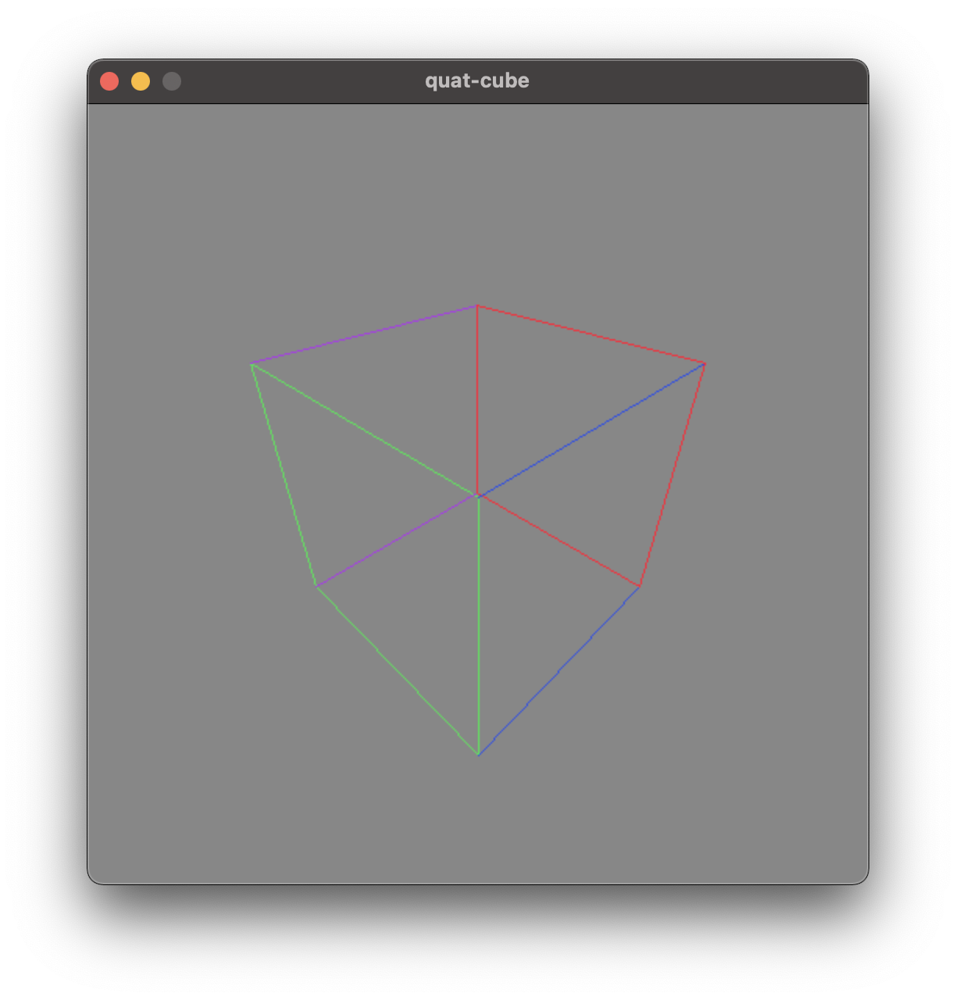
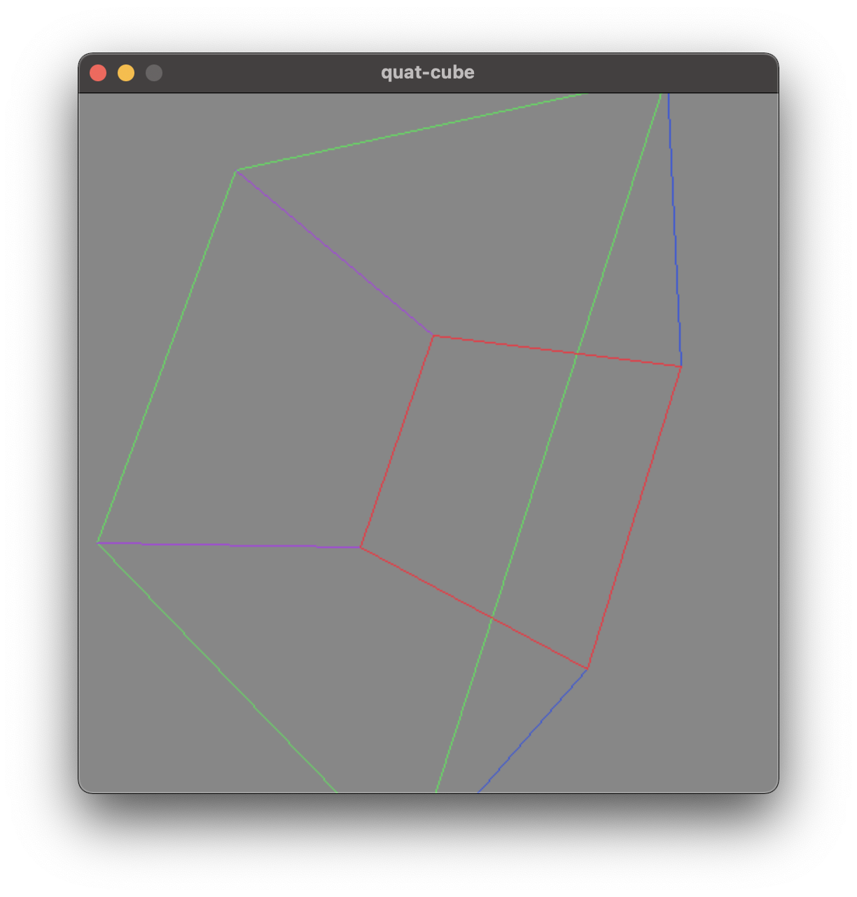
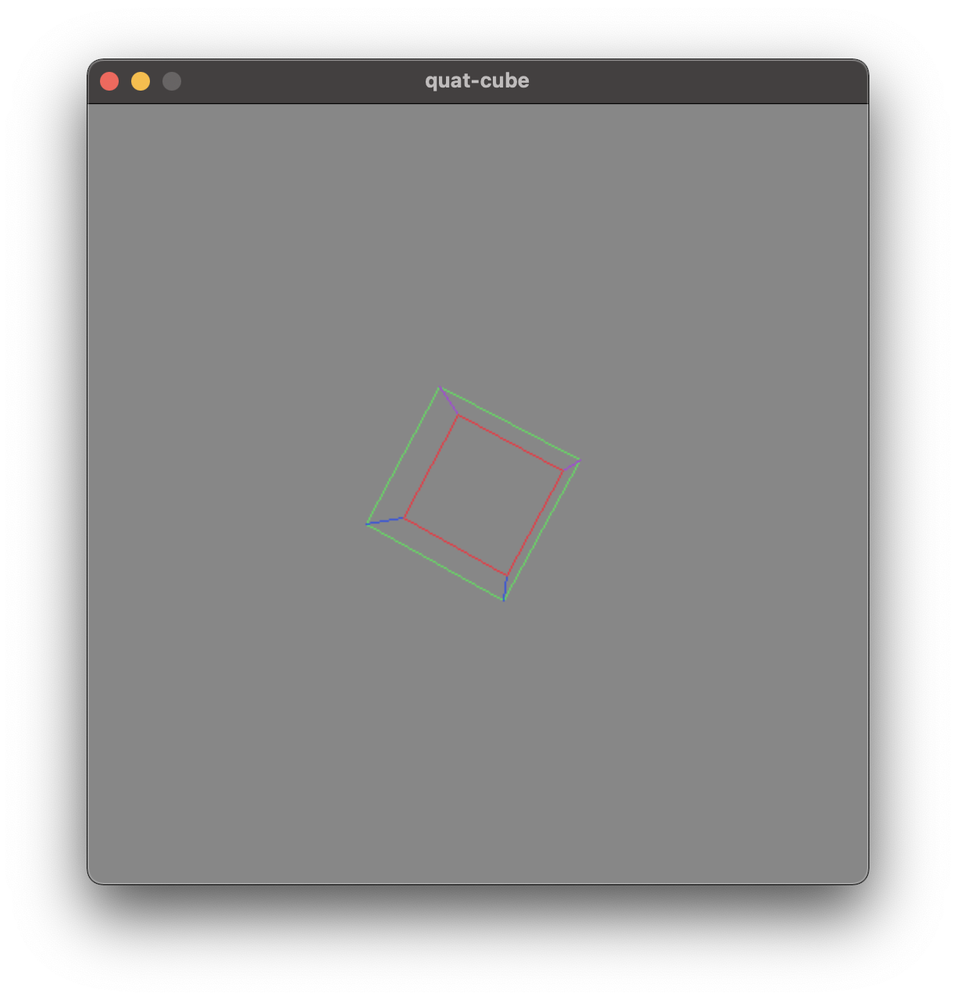

# quat-cube
by Nathan Nguyen

  
   
  

## Summary
quat-cube is a 3D math project written in C++ using the SDL2 framework. This project displays a rotating cube by implementing quaternions and perspective projection.
