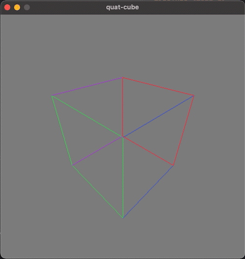
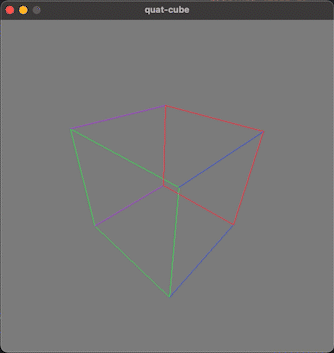

# quat-cube
by Nathan Nguyen
 
[Video Demo](https://youtu.be/rvsY0ctKJ-g)

  
  

## Description
quat-cube is a 3D math project written in C++ using the SDL2 framework. This project displays a rotating cube by implementing quaternions and perspective projection. The implementation assumes a right-handed coordinate system. The camera can be zoomed in and out.

## Dependencies
- C++17
- [SDL2](https://www.libsdl.org/)
- developed in Xcode
